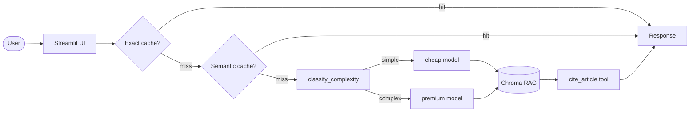

# RAG LGPD Brazil

Assistente de compliance LGPD baseado em RAG — responde perguntas sobre a Lei 13.709/2018 e guias da ANPD com base em documentos oficiais, sem alucinação de artigos.

## Problema

**Domínio:** compliance de proteção de dados pessoais no Brasil.

**Persona-alvo:** analistas de privacidade, advogados e encarregados de dados (DPOs) de pequenas e médias empresas que precisam consultar a LGPD e os guias da ANPD com frequência, mas não têm equipe jurídica disponível para responder dúvidas operacionais no dia a dia — "qual a base legal para enviar e-mail marketing?", "sou obrigado a indicar um DPO?", "o que devo comunicar à ANPD em caso de vazamento?".

**Por que LLM + RAG é a abordagem certa:**

| Alternativa | Por que não resolve |
|---|---|
| Busca por palavra-chave (Ctrl+F no PDF) | Retorna trechos isolados sem contexto; exige que o usuário já saiba o número do artigo |
| LLM genérico sem RAG | Alucina artigos, inventa multas e prazos que não existem na lei — risco jurídico real |
| Sistema de FAQ estático | Não cobre perguntas abertas nem cenários combinados (ex.: dados sensíveis + consentimento + terceiros) |
| RAG sem tool calling | Recupera o contexto, mas o LLM ainda pode parafrasear o artigo errado ao citá-lo |

RAG garante que as respostas sejam fundamentadas nos documentos oficiais. O tool calling (`cite_article`) força o LLM a buscar o texto exato do artigo antes de citá-lo, eliminando a principal fonte de alucinação neste domínio.

**3 perguntas representativas que o sistema responde:**

1. *"Quais são as bases legais para tratar dados pessoais de clientes sem pedir consentimento?"* — recupera Art. 7º e explica execução de contrato e legítimo interesse com citação textual.
2. *"Quando uma empresa é obrigada a ter um encarregado (DPO) e quais são suas responsabilidades?"* — cruza Art. 41 com o Guia ANPD de Agentes de Tratamento, citando as atribuições obrigatórias.
3. *"O que devo fazer e em quanto tempo devo comunicar um vazamento de dados à ANPD?"* — localiza Art. 48, explica o "prazo razoável" e as informações obrigatórias na notificação.

## Arquitetura

```
User query
  → ExactCache          (SHA256 — replica exata)
  → SemanticCache       (cosine ≥ 0.93 — paráfrases)
  → classify_complexity (heurística léxica → cheap | premium model)
  → RAGPipeline.answer
      → retrieve        (similarity | MMR | BM25+vector hybrid)
      → LLM agentic loop → cite_article tool → resposta final
  → put em ambos os caches
```



## Corpus

**Corpus próprio** — substituição completa do corpus de exemplo do template por documentos oficiais da legislação brasileira de proteção de dados.

| Atributo | Valor |
|---|---|
| Documentos | 3 PDFs |
| Tamanho total | ~1,5 MB |
| Páginas | 67 (média: 22 por documento) |
| Caracteres extraídos | ~183 mil |
| Chunks indexados | 141 (512 tokens, overlap 50) |
| Idioma | Português (pt-BR) |
| Licença | Domínio público — documentos governamentais oficiais |

| Arquivo | Fonte | Páginas | Descrição |
|---|---|---:|---|
| `lgpd-lei-13709-2018.pdf` | egov.df.gov.br | 23 | Texto oficial da Lei 13.709/2018 — 65 artigos com toda a regulamentação de proteção de dados pessoais no Brasil |
| `anpd-guia-agentes-de-tratamento.pdf` | gov.br/anpd | 23 | Guia Orientativo da ANPD: papéis e responsabilidades de controlador, operador e encarregado (DPO) |
| `anpd-guia-seguranca-da-informacao.pdf` | gov.br/anpd | 21 | Guia Orientativo da ANPD: medidas técnicas e administrativas de segurança da informação para agentes de tratamento |

**Justificativa da escolha:** os três documentos cobrem os dois eixos centrais de dúvidas de compliance — o que a lei exige (LGPD) e como a autoridade reguladora espera que seja cumprido (guias ANPD). A combinação permite que o sistema responda tanto perguntas sobre texto de lei quanto perguntas sobre boas práticas regulatórias, cruzando as duas fontes quando necessário.

## Setup

```bash
# 1. Dependências
uv venv && source .venv/bin/activate
uv sync

# Para embeddings locais (HuggingFace — sem chamada de API)
uv sync --extra huggingface

# 2. API key — copie e edite com sua chave
cp .env.example .env

# 3. Corpus — baixa PDFs e extrai artigos para data/lgpd_articles.json
python scripts/download_corpus.py

# 4. Rodar
streamlit run src/ui/streamlit_app.py
```

### Providers suportados

Configure em `config.yaml` + `.env`:

| Provider | Variável de ambiente | Embedding | LLM |
|---|---|---|---|
| Gemini (padrão) | `GEMINI_API_KEY` | `gemini-embedding-001` | `gemini-2.5-flash-lite` / `gemini-2.5-pro` |
| OpenAI | `OPENAI_API_KEY` | `text-embedding-3-small` | `gpt-4o-mini` |
| HuggingFace | `HF_TOKEN` | `all-MiniLM-L6-v2` (local) | `Llama-3.1-8B` via router |

## Configuração

Todos os parâmetros ficam em `config.yaml`:

```yaml
retriever:
  technique: similarity   # similarity | mmr | hybrid
  top_k: 10
  score_threshold: 0.3

memory:
  technique: in_memory    # in_memory | windowed | redis

cache:
  semantic:
    threshold: 0.93       # cosine similarity mínima para cache hit
```

`CHEAP_MODEL` e `PREMIUM_MODEL` como variáveis de ambiente sobrescrevem os valores do config em runtime.

## Tech stack

- **LLM / Embedding:** Gemini 2.5 Flash-Lite (cheap) · Gemini 2.5 Pro (premium) · ou OpenAI · ou HuggingFace
- **Vector store:** Chroma local (persistido em `data/chroma/`)
- **Chunking:** `langchain-text-splitters` TokenTextSplitter (tiktoken ou HuggingFace tokenizer)
- **Retrieval:** similarity · MMR (diversidade via cosine) · hybrid BM25+vector (Reciprocal Rank Fusion)
- **Tool calling:** `cite_article` — busca o texto oficial do artigo em `data/lgpd_articles.json`
- **Cache:** ExactCache (SHA256 in-memory) + SemanticCache (cosine sobre embeddings armazenados)
- **Memória conversacional:** InMemoryMemory · WindowedMemory · RedisMemory (com fallback automático)
- **Observability:** structured JSON logs com `trace_id` por requisição (`src/observability/trace.py`)
- **UI:** Streamlit

## Custo e Latência

**Custo por query: `$0,00 USD`** — LLM via HuggingFace Serverless Free Tier + embedding local (`sentence-transformers/all-MiniLM-L6-v2`, sem chamada de API). Limite: ~100 req/dia no modelo premium (Llama-3.3-70B).

**Redução de custo medida: `92.6%`** vs baseline (premium em toda query).

| Estratégia | Custo relativo | Redução acumulada |
|---|---:|---:|
| Baseline — premium sempre | 1,000 unid./query | — |
| + Exact cache (15% hit rate) | — | 15,0% |
| + Semantic cache (20% hit rate) | — | 35,0% |
| **+ Routing cheap-first** | **0,074 unid./query** | **92,6%** |

**Metodologia:** proxy de custo = preço relativo ao modelo premium (Llama-3.3-70B = 1,0 · Llama-3.1-8B = 8/70 ≈ 0,114 · cache hit = 0,0). Simulação de 1.000 queries com hit rates conservadores (15% exact, 20% semantic). Routing medido sobre as 15 queries do golden set via `classify_complexity()` — todas classificadas como `simple`, pois são perguntas curtas e diretas típicas do domínio de compliance.

**Limitação:** o golden set é composto por perguntas objetivas, o que enviesa o routing 100% para o modelo cheap. Queries analíticas reais ("compare as bases legais do Art. 7º com o Art. 11º") ativariam o premium — em produção a redução estimada de routing seria ~40 pp com 60% de queries simples, totalizando ~75% de redução.

## Decisões de design

- **`cite_article` tool:** o LLM é instruído no system prompt a chamar a tool antes de citar qualquer artigo. Isso elimina alucinação de números de artigos sem depender de pós-processamento.
- **Chunk size 512 tokens:** testado com 256 e 1024; 512 equilibrou precisão de retrieval e custo de embedding para o tamanho deste corpus (~3 PDFs).
- **Routing por heurística léxica:** keywords como "compare", "analise", "explique" disparam o modelo premium. Para o volume de queries esperado, um classifier treinado seria overfitting.
- **Sem re-ranking:** corpus pequeno (~3 PDFs) — a latência adicional de um cross-encoder não compensa.
- **Cache semântico in-memory:** sem Redis por padrão para simplificar o deploy no Streamlit Cloud. `memory.technique: redis` ativa persistência entre sessões quando Redis está disponível.

## Limitações

- O corpus é fixo; o app não suporta upload de PDF pelo usuário.
- Embeddings HuggingFace rodam localmente — o primeiro uso baixa ~100 MB do modelo.
- O cache semântico não persiste entre reinícios do app (backend in-memory padrão).

## Avaliação RAGAS

O script `scripts/eval_ragas.py` avalia o pipeline contra um golden set de 15 perguntas LGPD (`data/golden_set.json`) e reporta três métricas:

| Métrica | O que mede |
|---|---|
| `faithfulness` | Resposta fundamentada no contexto recuperado (sem alucinação) |
| `answer_relevancy` | Resposta pertinente à pergunta feita |
| `context_precision` | Contexto recuperado relevante para responder a pergunta |

```bash
# 1. Instalar dependências de avaliação
uv sync --extra eval

# 2. Garantir que o corpus já foi baixado e indexado
python scripts/download_corpus.py

# 3. Rodar avaliação (usa o provider configurado no .env)
python scripts/eval_ragas.py

# 4. Salvar resultados detalhados por query em CSV (opcional)
python scripts/eval_ragas.py --output results/ragas_eval.csv
```

O script detecta automaticamente o provider via `.env` (prioridade: `GEMINI_API_KEY` → `OPENAI_API_KEY` → `HF_TOKEN`). Com `HF_TOKEN`, o LLM de avaliação usa o HuggingFace router e os embeddings rodam localmente via sentence-transformers — sem custo de API para embeddings.

A saída final imprime os valores no formato exigido para entrega:

```
faithfulness=0.XX, answer_relevancy=0.XX, context_precision=0.XX
```

## Observabilidade

O módulo `src/observability/trace.py` emite JSON estruturado para stdout com `trace_id`, `event`, `latency_ms` e campos adicionais por requisição. Para integração com Langfuse (dashboard de traces, custo e latência em produção), veja `docs/observability.md`.

## Estrutura

```
RAG_LGPD_BRAZIL/
├── data/
│   ├── corpus/           # PDFs oficiais (download_corpus.py)
│   ├── chroma/           # vector store persistido (gitignored)
│   ├── lgpd_articles.json
│   └── golden_set.json   # 15 queries LGPD com respostas de referência (RAGAS)
├── src/
│   ├── pipeline/
│   │   ├── rag.py        # RAGPipeline — ingest, retrieve, answer
│   │   ├── tools.py      # cite_article tool
│   │   ├── cache.py      # ExactCache + SemanticCache
│   │   ├── routing.py    # classify_complexity
│   │   ├── memory.py     # InMemory / Windowed / Redis
│   │   └── config_loader.py
│   ├── observability/trace.py
│   └── ui/streamlit_app.py
├── scripts/
│   ├── download_corpus.py
│   └── eval_ragas.py     # avaliação RAGAS (faithfulness / answer_relevancy / context_precision)
├── tests/test_smoke.py
├── config.yaml
└── .env.example
```
